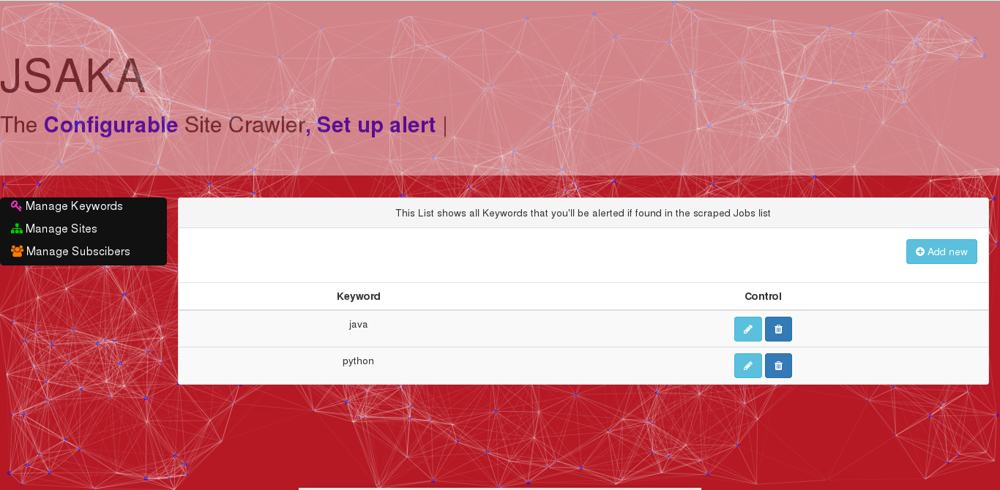
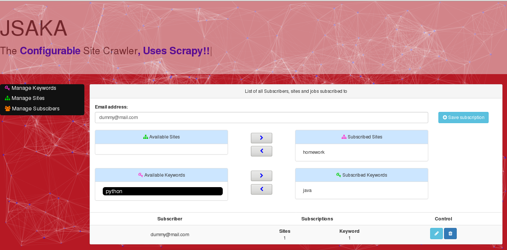

# JSAKA
Highly Customizable Word Scrapper, with minimal foot print. Uses Scrapy for crawling and has a configuration panel to configure some crawlers behaviors.
JSAKA uses scrapy framework to develop spiders, the scrapped data is then stored. The web interface allows you to configure keywords that one should be alerted via email once they are detected in the scrapped data.

# Screenshots
Keyword manager

Subscription Manager

